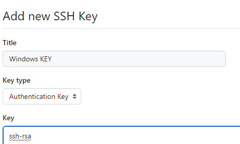
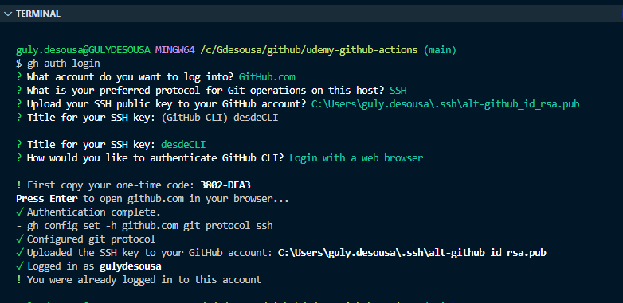

## .git *-hidden folder-*

Directorio oculto que nos dice que nuestra carpeta es un repositorio.

Con el `VS Code` podemos explorarla si cambiamos la configuración que nos oculta el directorio.

La opción la puedes encontrar desde **Settings** y buscando *files Exclude*

Para crear un nuevo repositorio en un nuevo proyecto se inicializa el repo con `git init`

```sh
git init
```

## gitconfig *file*

Archivo donde se guardan las configuraciones globales para git, como usuario, mail, editor entre otros

```sh
git config --list
```

Cuando instalar el git debes inicializar los valores de nombre e emal.

```sh
git config --global user.name "Guly de Sousa"
git config --global user.email "gdesousa@gmail.com"
```


## Clonning

Existen tres tipos de clonning: **HTTPS, SSH, Github CLI**


```sh
git clone https://github.com/seawaving/udemy-github-actions.git
```

### HTTP
> Venimos de clonar por **HTTP**

```sh
git clone https://github.com/seawaving/udemy-github-actions.git
```

Este tipo de autenticación requiere un token.

Creamos el Personal Access Token desde `(user)/settings/<Developer Settings>/Personal Access Tokens/Fine-grained tokens`

Asignamos solo los permisos necesarios
- **Commit statuses** (Read-Write)
- **Contents** (Read-Write)

Generamos y copiamos el token, es ese valor el que usaremos para hacer push cuando nos pida un password.

### SSH
> Venimos de clonar con **SSH**
> Los comandos los ejecutamos con el **gh bash**

Si el repositorio es privado, la credencial debería estar ya seteada para poder bajar el repositorio.
Este es publico, por lo que la credencial la vamos a necesitar para hacer push solamente.

```sh
git clone git@github.com:gulydesousa/udemy-github-actions.git
```

Esta autenticacion requiere una clave **SSH** que vamos a generar

> Dejaremos el SSH en la ruta `C:\Users\guly.desousa\.ssh`

```sh
ssh-keygen -t rsa 

Enter file in which to save the key (/c/Users/guly.desousa/.ssh/id_rsa): /c/users/guly.desousa/.ssh/alt-github_id_rsa

# Copiamos la clave publica en el github
cat /c/users/guly.desousa/.ssh/alt-github_id_rsa.pub

```
Creamos la SSH desde `(user)/settings/SSH and GPG keys`



Comprobar que tenemos acceso por **SSH**
```sh
ssh -T git@github.com

# Arrancamos el agente ssh
eval $(ssh-agent -s)

# Agregamos la clave privada
ssh-add /c/users/guly.desousa/.ssh/alt-github_id_rsa
```

Ya nos deja hacer el push


## SSH desde el CLI

Nos guia paso a paso para crear el SSH y nos crea el SSH el nuestra cuenta.

```ssh
gh auth login
```




### GitHub CLI

- Instalar el CLI. 
En el caso de windows lo he hecho con el ejecutable que me bajé de GitHub

```sh
 gh --version

gh repo clone gulydesousa/udemy-github-actions /c/Gdesousa/github/udemy-github-actions

```

### Clonning en el codespace

Creamos un directorio temporal en el `workspace`

```sh
mkdir /workspace/tmp
cd /workspace/tmp
git clone https://github.com/seawaving/udemy-github-actions.git
#Para ver los archiivos en el directorio
ls -la
#Inicializamos el repositorio
git init
#Hacemos el cambio para el readme file
touch Readme.md
open Readme.md
#Hacer cambios en el readme.md y ver los cambios pendientes
git status
# Agregamos todos los cambios al commit
git add .
# Deshacemos el add con reset
git reset
# Agregamos solo el readme.md
git add Readme.md
git commit -a -m "add readme file"
```

## Add

Para hacer stage de todos los cambios o de un archivo en particular.

```sh
git add  Readme.md
git add .
```

## Reset

Esta opcion nos permite mover los cambios staged a unstaged.
Esto nos permite revertir todos los cambios.

```sh
git add .
git reset
```
> `git reset` revierte un `git add .`


## Status

Muesta los archivos que se va a hacer commit, así como los que quedarían por fuera.

```sh
git status
```

## Commits

Cuando queremos hacer commit nos abrirá una ventana de edición del commit para poner un mensaje .

```sh
git commit
```

Se puede configurar el editor global

```sh
git config --global core.editor emacs
```

Commit sin abrir el editor

```sh
git commit -m "informacion del cambio"
```

## Log

`git log` muestra información de los logs recientes


## Push

Para subir los cambios al repositorio remoto de origen

```sh
git push
```

## Branches

```sh
#Para listar las ramas
git branch

#Para crear una rama
git branch develop

#Para subir la rama al repositorio remoto
git push --set-upstream origin develop
```

### Checkout branch

Hacer "checkout" a una rama en Git significa cambiar desde la rama actual a otra rama. 

Cuando haces checkout a una nueva rama, tu directorio de trabajo se actualiza para reflejar el contenido de la nueva rama, tus archivos se actualizan para coincidir con las versiones presentes en la rama y Git comienza a registrar tus nuevos commits en esa rama.


```sh
#Para cambiarnos de rama
git checkout develop
```

## Fetch
El comando `git fetch` en Git se utiliza para descargar todos los cambios recientes en el repositorio remoto que aún no están presentes en tu repositorio local. No fusiona automáticamente estos cambios en tu rama actual ni modifica tus archivos de trabajo. Solo trae las actualizaciones a tu repositorio local para que puedas revisarlas y decidir si quieres integrarlas en tu trabajo actual.


```sh
#Actualizar la rama con lo que hay en el repo 
git fetch
```

## Remotes


## Stashes

## Merging